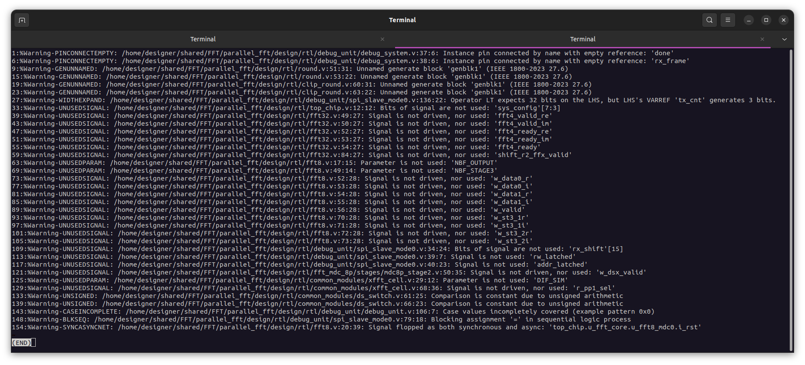
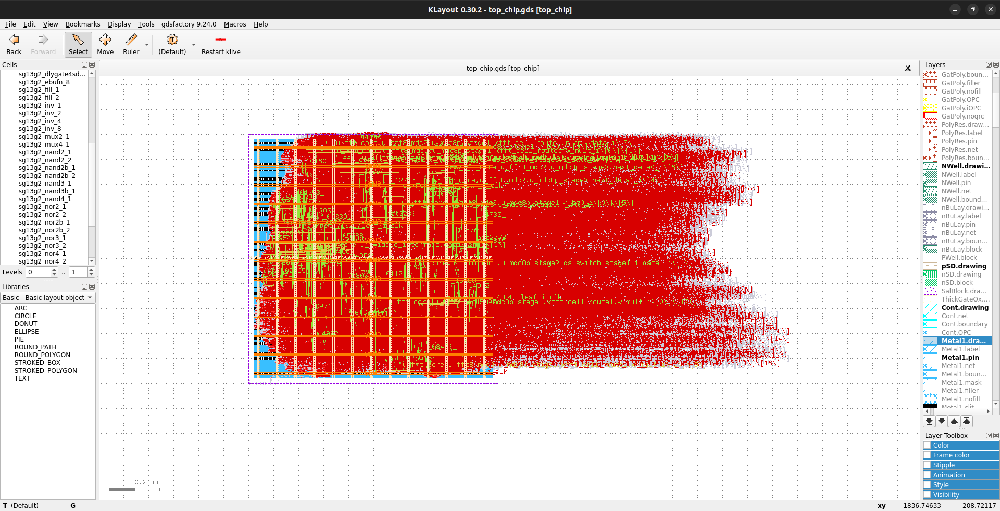

# Parallel FFT – PD Log (LibreLane)

## RTL files used (relative paths)

> **Repository root:** `parallel_fft/`  
> **Relative paths:** from `parallel_fft/` (i.e., `dir::` resolves from this root when using `--design-dir`)

| Block | File | Relative path |
|---|---|---|
| Top | `top_chip.v` | `design/rtl/top_chip.v` |
| FFT | `fft32.v` | `design/rtl/fft32.v` |
| FFT | `fft8.v` | `design/rtl/fft8.v` |
| FFT | `fft4.v` | `design/rtl/fft4.v` |
| Helpers | `buffer_parallel2serial.v` | `design/rtl/buffer_parallel2serial.v` |
| Helpers | `clip_round.v` | `design/rtl/clip_round.v` |
| Helpers | `round.v` | `design/rtl/round.v` |
| Helpers | `shift_r2.v` | `design/rtl/shift_r2.v` |
| Helpers | `shift_r4.v` | `design/rtl/shift_r4.v` |
| MDC8P | `fft_mdc_8p.v` | `design/rtl/fft_mdc_8p/fft_mdc_8p.v` |
| MDC8P | `mdc8p_ctrl_in.v` | `design/rtl/fft_mdc_8p/ctrl_in/mdc8p_ctrl_in.v` |
| MDC8P | `mdc8p_ctrl_out.v` | `design/rtl/fft_mdc_8p/ctrl_out/mdc8p_ctrl_out.v` |
| MDC8P | `mdc8p_stage1.v` | `design/rtl/fft_mdc_8p/stages/mdc8p_stage1.v` |
| MDC8P | `mdc8p_stage2.v` | `design/rtl/fft_mdc_8p/stages/mdc8p_stage2.v` |
| MDC8P | `mdc8p_stage3.v` | `design/rtl/fft_mdc_8p/stages/mdc8p_stage3.v` |
| Twiddles | `twiddle_interface.v` | `design/rtl/twiddle_interface/twiddle_interface.v` |
| Common | `btfly_2.v` | `design/rtl/common_modules/btfly_2.v` |
| Common | `btfly_4.v` | `design/rtl/common_modules/btfly_4.v` |
| Common | `btfly_8.v` | `design/rtl/common_modules/btfly_8.v` |
| Common | `complex_multiplier.v` | `design/rtl/common_modules/complex_multiplier.v` |
| Common | `ds_switch.v` | `design/rtl/common_modules/ds_switch.v` |
| Common | `rx_serializer.v` | `design/rtl/common_modules/rx_serializer.v` |
| Common | `tx_serializer.v` | `design/rtl/common_modules/tx_serializer.v` |
| Common | `xfft_cell.v` | `design/rtl/common_modules/xfft_cell.v` |
| Common | `signal_generator.v` | `design/rtl/common_modules/signal_generator.v` |
| Debug | `debug_system.v` | `design/rtl/debug_unit/debug_system.v` |
| Debug | `debug_unit.v` | `design/rtl/debug_unit/debug_unit.v` |
| Debug | `spi_slave_mode0.v` | `design/rtl/debug_unit/spi_slave_mode0.v` |
| Debug | `cdc_snapshot.v` | `design/rtl/debug_unit/cdc_snapshot.v` |

---

## File/module conflict: `cdc_snapshot.v`

There are two copies of the same module in the repository:

- `design/rtl/common_modules/cdc_snapshot/cdc_snapshot.v`
- `design/rtl/debug_unit/cdc_snapshot.v`

**Decision:** use **only** `design/rtl/debug_unit/cdc_snapshot.v` to avoid duplicate module definitions.

---

## Project
- Design: `top_chip`
- PDK: `ihp-sg13g2`
- Clock: `i_clk` @ 50 ns
- Repo root: `parallel_fft/`
- SDC: `librelane/constraints/top.sdc`

---

## Run: `RUN_2026-01-18_04-06-07`

### Configuration (`librelane/config.yaml`)

```yaml
DESIGN_NAME: top_chip

VERILOG_FILES:
  # Top / FFT
  - dir::design/rtl/top_chip.v
  - dir::design/rtl/fft32.v
  - dir::design/rtl/fft8.v
  - dir::design/rtl/fft4.v

  # Datapath helpers
  - dir::design/rtl/buffer_parallel2serial.v
  - dir::design/rtl/clip_round.v
  - dir::design/rtl/round.v
  - dir::design/rtl/shift_r2.v
  - dir::design/rtl/shift_r4.v

  # MDC8P
  - dir::design/rtl/fft_mdc_8p/fft_mdc_8p.v
  - dir::design/rtl/fft_mdc_8p/ctrl_in/mdc8p_ctrl_in.v
  - dir::design/rtl/fft_mdc_8p/ctrl_out/mdc8p_ctrl_out.v
  - dir::design/rtl/fft_mdc_8p/stages/mdc8p_stage1.v
  - dir::design/rtl/fft_mdc_8p/stages/mdc8p_stage2.v
  - dir::design/rtl/fft_mdc_8p/stages/mdc8p_stage3.v

  # Twiddles
  - dir::design/rtl/twiddle_interface/twiddle_interface.v

  # Common modules
  - dir::design/rtl/common_modules/btfly_2.v
  - dir::design/rtl/common_modules/btfly_4.v
  - dir::design/rtl/common_modules/btfly_8.v
  - dir::design/rtl/common_modules/complex_multiplier.v
  - dir::design/rtl/common_modules/ds_switch.v
  - dir::design/rtl/common_modules/rx_serializer.v
  - dir::design/rtl/common_modules/tx_serializer.v
  - dir::design/rtl/common_modules/xfft_cell.v
  - dir::design/rtl/common_modules/signal_generator.v

  # Debug / CDC / SPI
  - dir::design/rtl/debug_unit/debug_system.v
  - dir::design/rtl/debug_unit/debug_unit.v
  - dir::design/rtl/debug_unit/cdc_snapshot.v
  - dir::design/rtl/debug_unit/spi_slave_mode0.v

# Clock
CLOCK_PORT: i_clk
CLOCK_PERIOD: 50

# SDC
PNR_SDC_FILE: dir::librelane/constraints/top.sdc
SIGNOFF_SDC_FILE: dir::librelane/constraints/top.sdc

# Floorplan
FP_SIZING: absolute
DIE_AREA: [0, 0, 1000, 1000]
CORE_AREA: [20, 20, 980, 980]
```

### Result (signoff)
- LVS: PASS ✅
- DRC: PASS ✅
- Antenna: PASS ✅
- Setup violations: none ✅
- Hold violations: none ✅
- Max slew violations: none ✅
- Max capacitance violations: none ✅

### Artifacts
- Final views: `runs/RUN_2026-01-18_04-06-07/final/`
- LVS report: `runs/RUN_2026-01-18_04-06-07/69-netgen-lvs/reports/lvs.netgen.rpt`

### Flow warnings (summary)


---

*Lint warnings (Verilator):* `runs/RUN_2026-01-18_04-06-07/01-verilator-lint/verilator-lint.log`


***Warnings were observed. They do not directly affect the flow execution, so the run does not stop; however, some of them could indicate potential functional issues, so resolving them is proposed!***


## Metrics extracted from `44-openroad-detailedrouting/state_out.json` (OpenROAD detailed routing)


### Design size
- Instances (stdcells): **28,488**
- Routed nets: **28,063**
- IOs: **10** (`design__io`)
- Stdcell area: **464,100 µm²** (≈ **0.4641 mm²**)

### Floorplan / Area
- Die bbox: `0 0 1000 1000` → **1,000,000 µm²** (**1.0 mm²**) (TOTAL!)
- Core bbox (snapped): `20.16 22.68 979.68 979.02` -> Core area: **917,627 µm²** (≈ **0.9176 mm²**)
- Utilization (stdcells/core): **0.5058** (≈ **50.6%**) ; Interpretation: ~49.4% of the core is whitespace (comfortable margin for routing).

### Timing (slack)
**No timing violations reported (TNS/WNS = 0 in the reported corners).**  
Reported “worst” slacks:
- Corner `nom_fast_1p32V_m40C`:
  - Setup WS: **36.28 ns**
  - Hold WS: **0.123 ns**
- Corner `nom_slow_1p08V_125C`:
  - Setup WS: **19.13 ns**
  - Hold WS: **0.288 ns**
- Corner `nom_typ_1p20V_25C`:
  - Setup WS: **45.14 ns**
  - Hold WS: **0.176 ns**

> the target clock period is 50 ns, so the design **is very relaxed in setup**!!

### Power (estimated)
- Internal: **0.00583**
- Switching: **0.00173**
- Leakage: **6.02e-06**
- Total: **0.00756**  


### Routing and manufacturability
- Final router DRC: **0**
- Wirelength (detailed route): **705,400**
- Vias (total): **161,002** (singlecut: 161,002; multicut: 0)
- Antenna:
  - `route__antenna_violation__count`: **11**
  - `antenna__violating__nets`: **0**
  - `antenna_diodes_count`: **13**

> That means there was indeed an antenna risk during routing, and the flow **resolved it** by inserting 13 antenna diodes.




## Candidate sizes (estimated utilization)
Util estimate: `util ≈ stdcell_area / core_area` using 464,100 µm².

### Option  ~62.8%
- `DIE_AREA:  [0, 0, 900, 900]`
- `CORE_AREA: [20, 20, 880, 880]` → 860 × 860 = 739,600 µm²

### Option  ~69.0%
- `DIE_AREA:  [0, 0, 860, 860]`
- `CORE_AREA: [20, 20, 840, 840]` → 820 × 820 = 672,400 µm²

### Option  ~70.7% aggressive!!!
- `DIE_AREA:  [0, 0, 850, 850]`
- `CORE_AREA: [20, 20, 830, 830]` → 810 × 810 = 656,100 µm²

